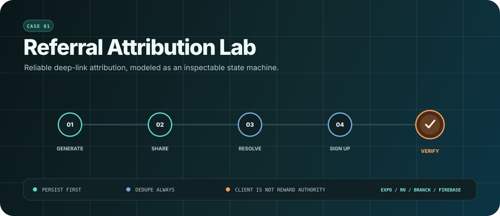

<div align="center">



# Referral Attribution Lab

**A production-shaped React Native case study for reliable referral attribution.**

Generate a durable referral identity, carry it through direct or deferred deep links, preserve it across process boundaries, and expose every accepted milestone in an inspectable event ledger.

[](https://hasan-al-hussein.github.io/referral-attribution-lab/)
[](https://github.com/Hasan-Al-Hussein/referral-attribution-lab/actions/workflows/ci.yml)
[](https://expo.dev/)
[](https://www.typescriptlang.org/)
[](https://github.com/Hasan-Al-Hussein/referral-attribution-lab/actions/workflows/ci.yml)

[Experience the flow](https://hasan-al-hussein.github.io/referral-attribution-lab/) · [Architecture](docs/ARCHITECTURE.md) · [Reliability evidence](docs/RELIABILITY_EVIDENCE.md) · [Native proof runbook](docs/NATIVE_PROOF_RUNBOOK.md) · [Security and privacy](docs/SECURITY_AND_PRIVACY.md)

</div>

## Why this project exists

Referral attribution looks simple until a click, an app install, a cold launch, a signup, and an analytics delivery happen in different processes and sometimes on different devices. This project treats that path as a reliability problem rather than a URL parameter demo.

The implementation is deliberately split into two honest execution modes:

| Mode | What it proves | What it does not claim |
| --- | --- | --- |
| Credential-free web demo | State transitions, input validation, persistence, deduplication, retries, routing, share outcomes, and analytics contracts | Native App Links, Universal Links, store installation, or provider delivery |
| Custom native build | Generated Branch and Firebase configuration, platform adapters, Android compilation, and a repeatable device test path | Real provider or store behavior until credentials, signed builds, and physical-device evidence are supplied |

The result is reviewable in a browser without blurring the boundary between simulation and external proof.

## Product experience

The interface is built around one signature object: a five-node attribution signal. Each node illuminates only when its corresponding event is durably accepted.

1. **Generate** creates a stable, human-readable `RAL-XXXXXXXX` identity.
2. **Share** records the actual share result, including cancellation or failure.
3. **Resolve** validates a direct or deferred callback through one strict parser.
4. **Start** freezes the originating attribution before signup begins.
5. **Verify** persists the accepted receipt before completion analytics and navigation.


Motion is finite and functional. Entry, state, share, validation, and completion transitions are bounded, clean up after themselves, and become immediately static when reduced motion is enabled.

### Interface gallery

| Responsive invite | Accepted callback |
| --- | --- |
|  |  |

<details>
<summary><strong>View verified completion state</strong></summary>

<br>


</details>

## Five-minute technical walkthrough

No account, provider key, or device installation is needed for the web path.

1. Open the [live demo](https://hasan-al-hussein.github.io/referral-attribution-lab/).
2. Select **Generate my referral link** and observe `referral_link_generated` in the ledger.
3. Select **Share my invitation**. The app uses Web Share where supported and a clipboard fallback otherwise.
4. Open **Reliability controls**, then select **Simulate direct callback** or **Simulate deferred callback**.
5. Complete the referred signup and watch the accepted journey reach `5/5`.
6. Reset the lab, submit an invalid payload, or use an email containing `+fail` to inspect rejected and retryable branches.

The deferred browser fixture sets the same first-session signal consumed by the native parser. It does not pretend that an app-store install happened.

## Architecture


The UI never calls Branch, Firebase, storage, or navigation directly. A single coordinator owns the transition policy, and platform files select the appropriate adapters.

```text
screens
  -> ReferralCoordinator
     -> strict referral parser and domain rules
     -> epoch-scoped AsyncStorage records
     -> durable analytics outbox and milestone receipts
     -> web or native deep-link adapter
     -> web or native share adapter
     -> visible ledger or Firebase Analytics adapter
```

### Reliability decisions

- **Persist before side effects.** A valid attribution is stored before analytics or routing.
- **Freeze identity at signup start.** A later callback cannot replace an in-flight referral.
- **Deduplicate by durable fingerprint.** Repeated callback delivery does not duplicate milestones.
- **Serialize critical transitions.** Callback and signup operations cannot race each other in-process.
- **Recover accepted outcomes.** A persisted backend receipt can complete analytics and navigation after interruption.
- **Keep reward authority server-side.** The client preserves attribution but never decides eligibility or issues value.

See [docs/ARCHITECTURE.md](docs/ARCHITECTURE.md) for the detailed data model, recovery cuts, concurrency policy, rollout plan, and production backend contract.

## Technical highlights

| Area | Implementation |
| --- | --- |
| Application | Expo 56, React Native 0.85, React 19, strict TypeScript |
| Navigation | React Navigation with buffered readiness and typed routes |
| Deep links | Branch native adapter plus a deterministic browser adapter |
| Analytics | Typed five-event contract, Firebase native delivery, durable outbox |
| Persistence | AsyncStorage epochs, migration, stale-writer repair, receipt recovery |
| Sharing | Native `Share.share`, Web Share, clipboard fallback, explicit outcomes |
| Verification | Jest, Expo Doctor, web export, native prebuild inspection, Android CI compile |
| Accessibility | Semantic labels, 44-point controls, keyboard focus, responsive layout, reduced motion |
| Privacy | No ad ID permission, no committed credentials, no PII in analytics payloads |

### Event contract

```ts
type RequiredReferralEventName =
  | 'referral_link_generated'
  | 'referral_link_shared'
  | 'referral_link_clicked'
  | 'referral_signup_started'
  | 'referral_signup_completed';
```

Every required event carries a normalized referral identity and platform context. Diagnostics use a separate allowlisted reason vocabulary so malformed links and duplicates remain observable without leaking raw untrusted payloads.

## Run locally

### Web demo

Requirements: Node.js 22 or newer and npm.

```bash
npm ci
npm run web
```

No environment file is required. With `NATIVE_SDK_BUILD` unset, the project uses deterministic local adapters and performs no provider network calls.

Create a production web export:

```bash
npm run build:web
npx serve dist
```

### Quality gates

```bash
npm run typecheck
npm run lint
npm test
npm run build:web
npx expo-doctor
```

CI additionally generates Android and iOS native projects with non-networked, package-correct fixtures. The Android job compiles a debug binary to verify the generated native surface.

### Verification snapshot

| Gate | Result |
| --- | --- |
| TypeScript | Passed with no emit |
| ESLint | Passed with zero warnings |
| Jest | 12 suites, 174 tests passed |
| Coverage | 90.40% statements, 82.63% branches, 90.82% functions, 93.22% lines |
| Expo Doctor | 21 of 21 checks passed |
| Web export | Production bundle generated from 608 modules |
| Android native structure | Clean prebuild and verification passed with fixtures |
| iOS native structure | Verified in Linux CI because Windows cannot generate the iOS project |

## Native provider mode

Native mode requires a custom Expo development, preview, or production build. Expo Go cannot load the Branch and React Native Firebase modules used here.

Copy the safe template and supply values from provider projects you control:

```bash
copy .env.example .env.local
```

Required native configuration includes:

- A Branch test or live key with the matching Branch domain.
- Android and iOS Firebase configuration files whose package IDs match `com.hasanalhussein.referrallab`.
- A custom build generated with `NATIVE_SDK_BUILD=1`.

The config fails closed on malformed domains, mismatched package IDs, wrong Branch key prefixes, duplicate domains, or missing platform files. Full setup and physical-device evidence steps are in [docs/NATIVE_PROOF_RUNBOOK.md](docs/NATIVE_PROOF_RUNBOOK.md).

## Repository map

```text
src/
  application/       orchestration, serialization, reset, recovery
  components/        signal visualization, event ledger, shared UI
  domain/            referral parser, invariants, event vocabulary
  motion/            reduced-motion-aware interaction primitives
  screens/            invite, referred onboarding, completion
  services/           deep links, analytics, sharing, persistence
  theme/              light and dark semantic design tokens
docs/
  visuals/            code-native README and architecture graphics
  ARCHITECTURE.md      detailed system design and failure analysis
  RELIABILITY_EVIDENCE.md verification matrix and proof boundaries
  NATIVE_PROOF_RUNBOOK.md device and store validation procedure
  SECURITY_AND_PRIVACY.md threat model and data-handling policy
```

## Proof boundary

This repository demonstrates the complete application-side attribution contract and a compiled native integration surface. It does not claim real Branch dashboard delivery, signed-domain association, store-mediated deferred installation, Firebase DebugView ingestion, production account creation, fraud eligibility, or reward settlement without the matching provider accounts, backend, signed builds, and physical-device evidence.

That boundary is a feature of the engineering work: evidence remains precise, reproducible, and honest.

## References

- [Expo development builds](https://docs.expo.dev/develop/development-builds/introduction/)
- [Branch React Native SDK reference](https://help.branch.io/developer-hub/docs/react-native-full-reference)
- [React Native Firebase Analytics](https://rnfirebase.io/analytics/usage)
- [Firebase Dynamic Links deprecation FAQ](https://firebase.google.com/support/dynamic-links-faq)
- [WCAG 2.2](https://www.w3.org/TR/WCAG22/)

## License

MIT. See [LICENSE](LICENSE).

<div align="center">

Built by [Hasan Al Hussein](https://github.com/Hasan-Al-Hussein) as a mobile growth-engineering and reliability case study.

</div>
