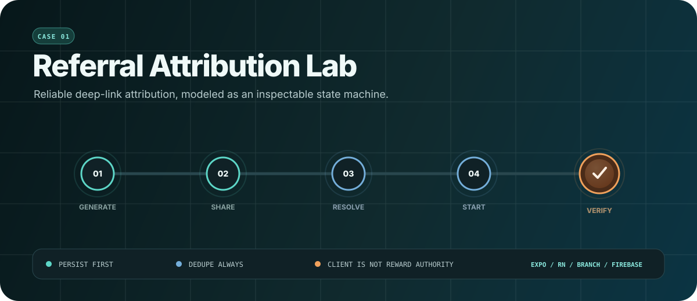
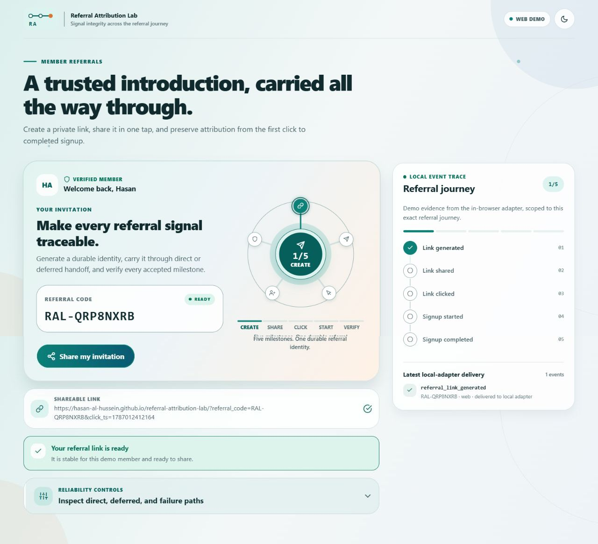
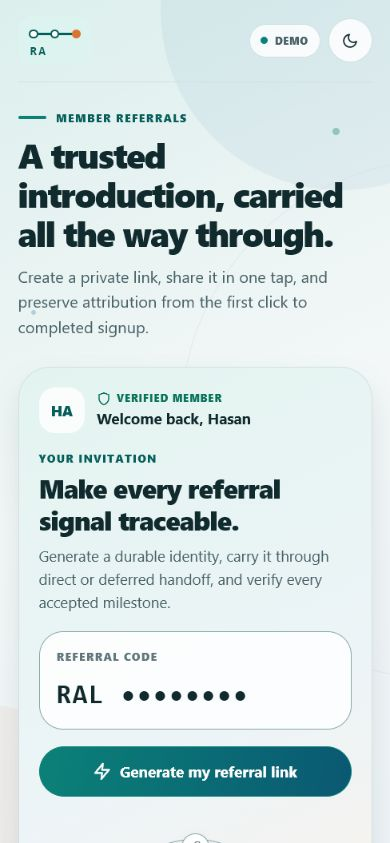
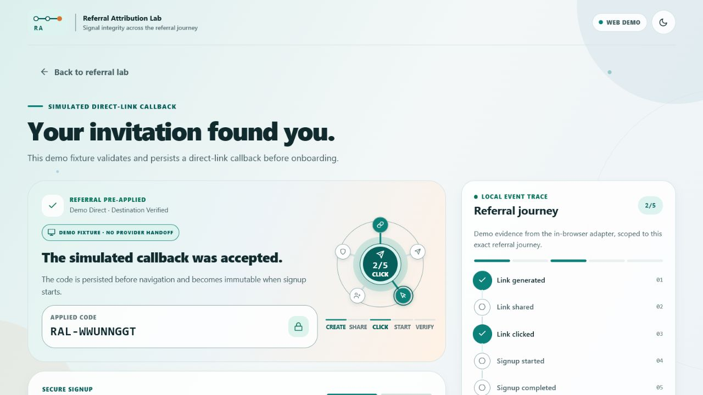
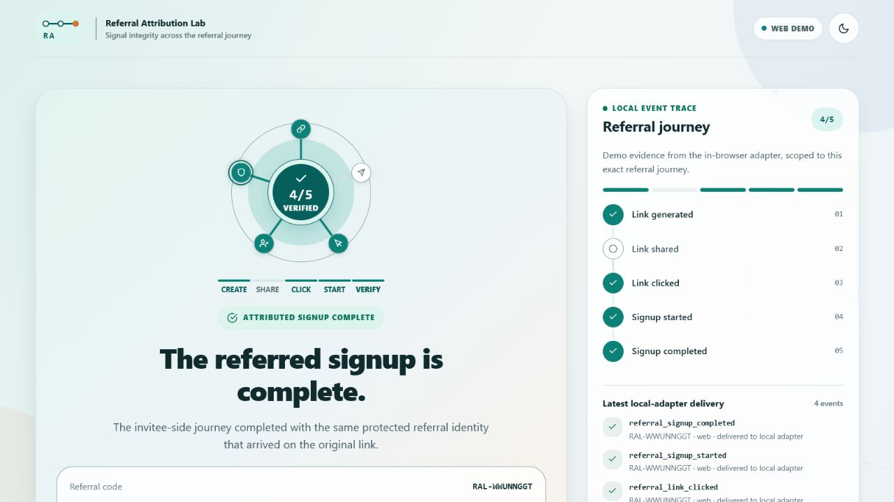
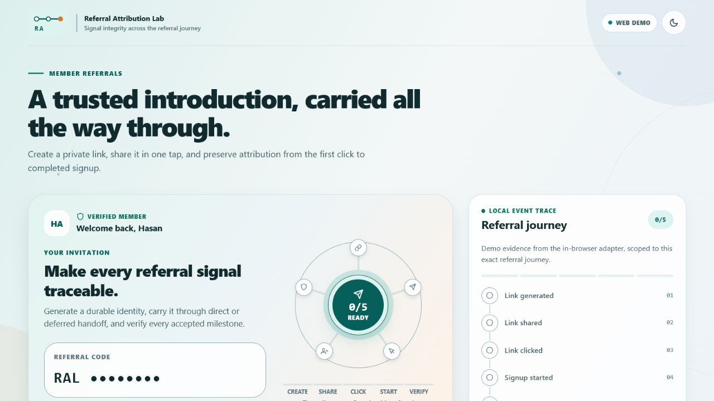
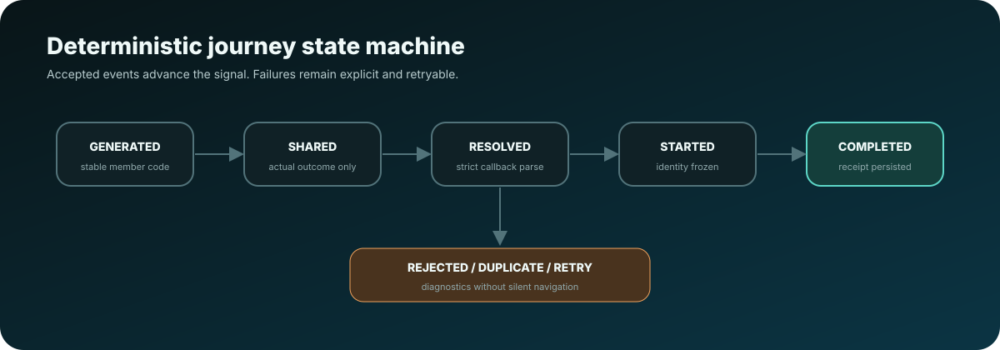
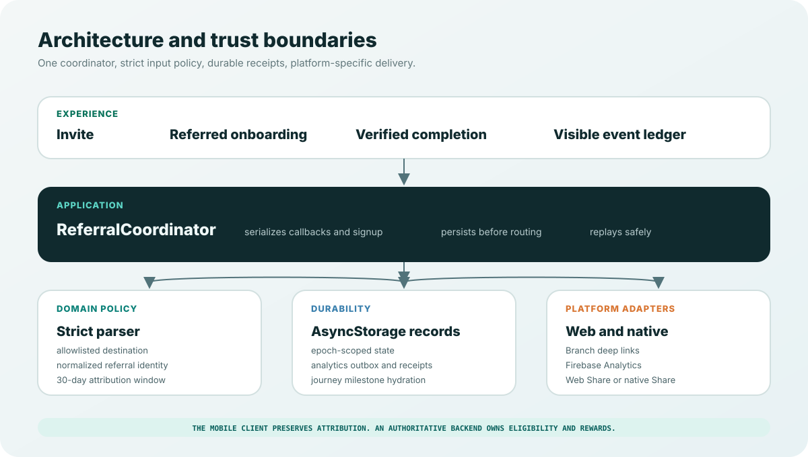

<div align="center">



# Referral Attribution Lab

**A production-shaped React Native case study for referral attribution that survives links, installs, restarts, retries, and interrupted signup.**

Generate one durable referral identity, carry it through direct or deferred deep links, route the recipient with the code pre-applied, and make every accepted milestone observable.

[](https://hasan-al-hussein.github.io/referral-attribution-lab/)
[](https://github.com/Hasan-Al-Hussein/referral-attribution-lab/actions/workflows/ci.yml)
[](https://github.com/Hasan-Al-Hussein/referral-attribution-lab/actions/workflows/ci.yml)
[](docs/RELIABILITY_EVIDENCE.md)
[](https://expo.dev/)
[](https://www.typescriptlang.org/)

[Launch the interactive demo](https://hasan-al-hussein.github.io/referral-attribution-lab/) · [Study the architecture](docs/ARCHITECTURE.md) · [Inspect reliability evidence](docs/RELIABILITY_EVIDENCE.md) · [Review security](docs/SECURITY_AND_PRIVACY.md)

</div>

## The problem

A referral is not just a URL. One journey can cross two devices, an app store, a cold launch, several asynchronous SDKs, account creation, and an unreliable analytics connection. A naive implementation silently loses attribution, double-counts events, or credits the wrong identity.

Referral Attribution Lab treats that journey as a distributed reliability problem:

- **The referrer** generates and shares a stable identity.
- **The recipient** arrives through a direct link or first launch after installation.
- **The application** validates and persists attribution before navigation.
- **Signup** freezes the accepted identity so a later callback cannot replace it.
- **Analytics** exposes five durable milestones without becoming the reward authority.

The browser demo makes the application behavior inspectable without credentials. The native configuration uses the real Branch and Firebase call shapes while keeping provider, store, and physical-device claims explicitly separate.

## Evidence at a glance

| Signal | Verified result |
| --- | --- |
| Automated tests | **174 passing** across 12 Jest suites |
| Coverage | **90.40% statements · 82.63% branches · 90.82% functions · 93.22% lines** |
| Expo health | **21/22 Expo Doctor checks passed**; the remaining check is the documented Expo 56 Hermes regression |
| Static quality | Strict TypeScript and ESLint with zero warnings |
| Native surface | Clean Android/iOS Prebuild inspection plus Android debug compilation in CI |
| Referral contract | Five required success events, typed diagnostics, durable receipts, and retry-safe event IDs |
| Experience | Responsive web/native layout, light and dark themes, keyboard focus, 44-point controls, and reduced-motion support |

## See the product

### One referral identity, visible from generation onward



### Responsive member experience and attributed onboarding

| Mobile referral entry | Validated direct-link onboarding |
| --- | --- |
|  |  |

<details>
<summary><strong>Open the verified signup state</strong></summary>

<br>



</details>

<details>
<summary><strong>Open the complete desktop referral entry</strong></summary>

<br>



</details>

## Try the complete journey

The reviewer path takes about two minutes and requires no account, API key, or installation.

1. Open the [live demo](https://hasan-al-hussein.github.io/referral-attribution-lab/).
2. Select **Generate my referral link** and verify `referral_link_generated`.
3. Select **Share my invitation**. The app uses Web Share when supported and a clipboard fallback otherwise.
4. Open **Reliability controls**, then choose **Simulate direct callback** or **Simulate deferred callback**.
5. Complete the referred signup and inspect the accepted journey in the event ledger.
6. Reset the lab, submit an invalid payload, replay the same link, cancel sharing, or use an email containing `+fail` to exercise recovery paths.

> [!IMPORTANT]
> The deferred browser fixture proves parsing, persistence, routing, signup continuity, and instrumentation after a first-session-shaped callback. It does not pretend that a real app-store installation occurred.

## What I engineered

- **One orchestration boundary.** Screens never coordinate Branch, Firebase, storage, and navigation independently; `ReferralCoordinator` owns transition policy and serialization.
- **Persist-before-route attribution.** A validated callback is durably stored before analytics or navigation, including cold-start delivery before the navigation tree is ready.
- **Immutable signup identity.** Starting signup freezes the originating code and fingerprint, preventing a later callback from stealing an in-flight referral.
- **Crash-aware completion.** A backend acceptance receipt is the commit point; analytics, cleanup, and success presentation can recover after interruption without relabeling an accepted signup as failed.
- **Durable analytics delivery.** A bounded local outbox retries with the same 128-bit `event_id`; milestone receipts suppress concurrent and replayed emissions.
- **Race-safe reset epochs.** Durable pointer publication, generation fencing, stale-writer repair, and retired-namespace cleanup prevent old sessions from overwriting new state.
- **Fail-closed native configuration.** Package IDs, Branch key modes, domains, Firebase files, intent filters, entitlements, and runtime settings are validated before native generation.
- **Truthful proof boundaries.** Browser behavior, generated native structure, provider delivery, store mediation, backend authority, and reward settlement are reported as distinct evidence levels.

## How the referral travels



| Stage | Application guarantee |
| --- | --- |
| **Generate** | A stable, human-readable `RAL-XXXXXXXX` code and usable link are created for the demo member. |
| **Share** | The actual OS/browser handoff result is recorded; cancellation is not counted as success. |
| **Resolve** | Direct and deferred callbacks enter one strict parser, route allowlist, and deduplication path. |
| **Start** | The exact accepted attribution identity is frozen before signup work begins. |
| **Verify** | Completion is emitted only after the backend acceptance receipt exists. |

### Direct and deferred paths

| App already installed | App not installed |
| --- | --- |
| The Branch HTTPS link opens through iOS Universal Links or Android App Links. A cached cold-start or warm callback reaches the same coordinator. | Branch records the click, routes through the store, and returns attribution on first launch using platform-specific install handoff. The app then uses the same parser, persistence, and route policy. |
| Repository proof covers callback parsing, persistence, buffering, routing, and duplicate suppression. | Repository proof covers the post-callback application path. Real store mediation requires the signed-device runbook. |

## Architecture



```text
React Native screens
  -> ReferralCoordinator
     -> strict domain parser and route allowlist
     -> epoch-scoped AsyncStorage records
     -> durable analytics outbox and milestone receipts
     -> Branch or deterministic browser deep-link adapter
     -> native or browser share adapter
     -> Firebase Analytics or inspectable local event ledger
```

Platform-specific files select adapters; product screens stay independent of provider SDK details. Analytics is observability, never the source of truth for eligibility or rewards.

## Reliability by design

| Silent production failure | Guardrail implemented | Deterministic evidence |
| --- | --- | --- |
| A link arrives while signup is freezing another referral | Shared serialized journey queue plus immutable frozen identity | Controlled link-versus-freeze interleaving tests |
| The SDK replays the same callback | SHA-256-derived 128-bit fingerprint and durable processed receipts | Direct, deferred, duplicate, numeric-timestamp, and legacy replay tests |
| Analytics fails after account acceptance | Acceptance receipt remains authoritative; post-commit work is retryable | Analytics timeout, cleanup failure, and restart recovery tests |
| The app crashes between persistence, analytics, cleanup, and navigation | Pending attribution, outbox records, milestones, and accepted receipts hydrate on restart | Three commit-to-presentation recovery cuts |
| A reset races an old asynchronous writer | Epoch pointer commit, generation fences, winner repair, and stale-key scavenging | Hung write, late write, retry, and cold-reload tests |
| Corrupt local data looks valid enough to survive | Every read path validates, bounds, rewrites, or removes physical records | Poisoned journey, marker, milestone, outbox, and receipt fixtures |
| Native credentials or identifiers are mismatched | Configuration fails closed before Prebuild or runtime | Test/live Branch, Firebase package, domain, and platform selection probes |

The full matrices are in [Reliability Evidence](docs/RELIABILITY_EVIDENCE.md), with deeper failure analysis in [Architecture](docs/ARCHITECTURE.md).

## Analytics contract

```ts
type RequiredReferralEventName =
  | 'referral_link_generated'
  | 'referral_link_shared'
  | 'referral_link_clicked'
  | 'referral_signup_started'
  | 'referral_signup_completed';
```

Every required event carries a normalized `referral_code`, `platform`, `event_id`, `flow_id`, `schema_version`, `app_version`, and UTC occurrence time. Optional attribution fields distinguish direct, deferred, and browser-fixture paths.

Failure and diagnostic events cover generation, share cancellation/failure, link resolution, rejected codes, signup failure, cleanup failure, and duplicate suppression. Reasons use a bounded allowlist; raw URLs, provider objects, form data, and credentials do not enter analytics.

## Technology

| Area | Choice |
| --- | --- |
| Application | Expo 56 · React Native 0.85 · React 19 · strict TypeScript |
| Navigation | React Navigation with typed routes and buffered readiness |
| Deep linking | Branch native adapter plus a deterministic browser adapter |
| Analytics | React Native Firebase Analytics plus a typed local evidence adapter |
| Persistence | AsyncStorage epochs, migration, outbox, receipts, recovery, and cleanup |
| Sharing | Native `Share.share`, Web Share, clipboard fallback, explicit outcomes |
| Motion | Finite transform/opacity primitives with reduced-motion behavior |
| Verification | Jest, Expo Doctor, web export, native Prebuild inspection, Android CI compile |

### Why Expo custom builds

Expo keeps one TypeScript application surface while still generating inspectable Android and iOS projects. This is **not an Expo Go implementation**: Branch and React Native Firebase require native modules, associated-domain/intent-filter configuration, and a custom development, preview, or production build.

### Why Branch

Firebase Dynamic Links shut down in 2025. Branch provides link creation, direct routing, and deferred attribution through one subscription API. Android can use the Play Install Referrer path; iOS NativeLink supports a pasteboard-mediated first-install handoff when configured and consented to.

## Run locally

Requirements: Node.js 22 or newer and npm.

```bash
npm ci
npm run web
```

No environment file is required for the credential-free browser build. With `NATIVE_SDK_BUILD` unset, deterministic local adapters perform no provider network calls.

### Run the full quality gate

```bash
npm run check
npm test -- --coverage
npm run build:web
npx expo-doctor
```

Native mode requires Branch/Firebase projects, package-correct configuration files, and a custom build. Follow [Native Proof Runbook](docs/NATIVE_PROOF_RUNBOOK.md) for the physical-device and store matrix.

> [!NOTE]
> Current Expo Doctor passes 21 of 22 checks. The remaining warning is the Hermes V1 memory regression fixed in Expo SDK 57 / React Native 0.86. The project stays on its tested Expo 56 compatibility set for this release; the next runtime upgrade is tracked as a deliberate migration rather than hidden behind a forced dependency change.

## Repository map

```text
src/
  application/       orchestration, serialization, reset, and recovery
  components/        referral signal, event ledger, and shared UI
  domain/            parser, invariants, identities, and event vocabulary
  motion/            reduced-motion-aware interaction primitives
  screens/           member invite, referred onboarding, and completion
  services/          deep links, analytics, sharing, persistence, mock API
  theme/             light and dark semantic design tokens
docs/
  visuals/           code-native hero, architecture, and state-machine graphics
  screenshots/       responsive product evidence
  ARCHITECTURE.md
  RELIABILITY_EVIDENCE.md
  SECURITY_AND_PRIVACY.md
  NATIVE_PROOF_RUNBOOK.md
```

## Proof boundary

This repository demonstrates the complete application-side attribution contract, deterministic browser behavior, generated native configuration, and Android compilation. It does **not** claim real Branch dashboard delivery, signed-domain association, store-mediated installation, Firebase DebugView ingestion, production account creation, fraud eligibility, or reward settlement without matching provider accounts, signed builds, physical devices, stores, and an authoritative backend.

That boundary is deliberate: evidence should be reproducible and precise, not inflated.

## References

- [Expo development builds](https://docs.expo.dev/develop/development-builds/introduction/)
- [Branch React Native SDK reference](https://help.branch.io/developer-hub/docs/react-native-full-reference)
- [React Native Firebase Analytics](https://rnfirebase.io/analytics/usage)
- [Firebase Dynamic Links deprecation FAQ](https://firebase.google.com/support/dynamic-links-faq)
- [WCAG 2.2](https://www.w3.org/TR/WCAG22/)

## License

MIT. See [LICENSE](LICENSE).

<div align="center">

Designed and engineered by **[Hasan Ahmed](https://github.com/Hasan-Al-Hussein)** as a mobile growth-engineering, attribution, and reliability case study.

</div>
